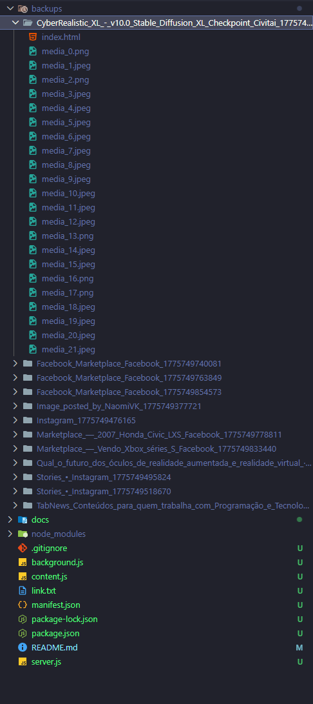
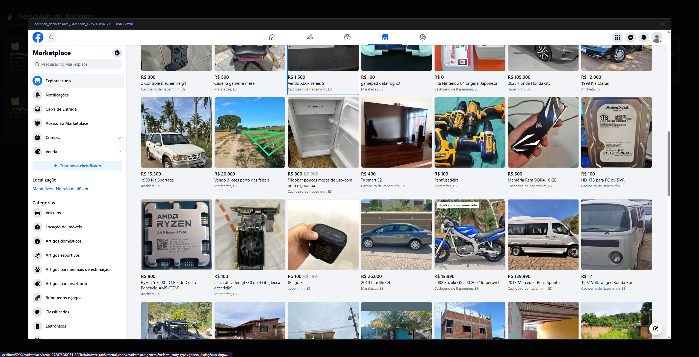
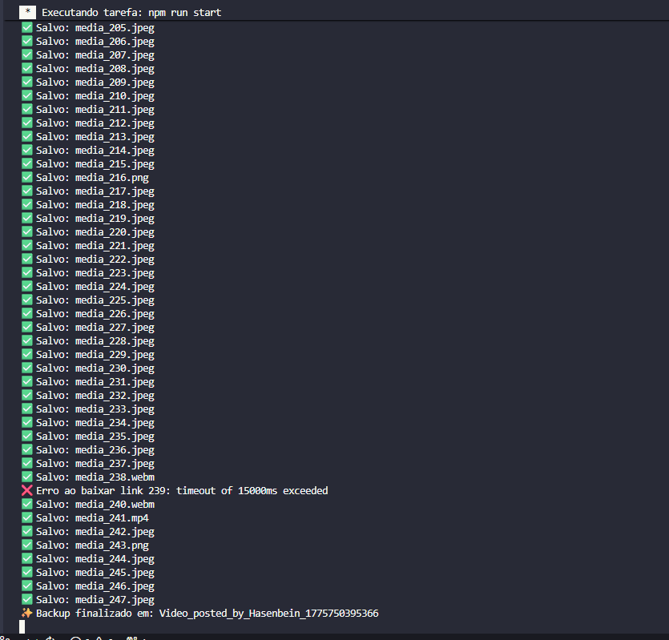
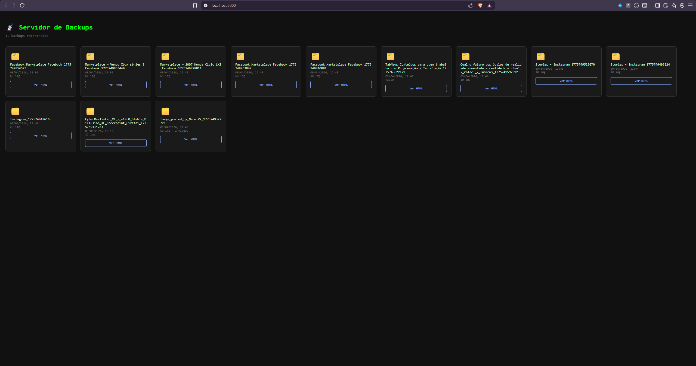

# Captura Snapshot — Download Offline / Servidor Local

Ferramenta para capturar páginas web completas (HTML + imagens) e armazená-las localmente via um servidor Node.js. Composta por uma extensão Chrome e um servidor Express.

---

## Como funciona

```text
Extensão Chrome  ──POST /save-backup──▶  Servidor Node.js  ──▶  backups/<titulo_timestamp>/
    (content.js)                              (server.js)              index.html
                                                                        media_0.png
                                                                        media_1.jpg
                                                                        ...
```

1. Você clica no ícone da extensão em qualquer aba.
2. O `content.js` injetado na página:
   - Converte todos os `<link rel="stylesheet">` em `<style>` inline.
   - Coleta URLs de imagens/vídeos (``, `<video>`, `<source>`).
   - Remove scripts e iframes para gerar um HTML estático leve.
   - Envia o pacote `{ html, links, title }` para `POST /save-backup`.
3. O servidor cria uma pasta `backups/<titulo>_<timestamp>/`, salva o `index.html` e baixa cada mídia sequencialmente.
4. Acesse `http://localhost:5000` para navegar pelos backups na interface web.

---

## Estrutura do projeto

```text
.
├── server.js          # Servidor Express: API + interface web de backups
├── background.js      # Service worker da extensão (injeta o content script)
├── content.js         # Script injetado na página capturada
├── manifest.json      # Manifesto da extensão Chrome (Manifest V3)
├── package.json       # Dependências e scripts npm
├── .gitignore         # Ignora backups/ e node_modules/
└── backups/           # Pasta gerada automaticamente (não versionada)
    └── <titulo>_<timestamp>/
        ├── index.html
        ├── media_0.png
        └── ...
```

---

## Requisitos

- **Node.js** 18 ou superior
- **Google Chrome** (ou Chromium)

---

## Instalação

```bash
npm install
```

---

## Uso

### 1. Iniciar o servidor

```bash
npm start
```

O servidor sobe em `http://localhost:5000`.

### 2. Instalar a extensão no Chrome

1. Abra `chrome://extensions`
2. Ative o **Modo do desenvolvedor** (canto superior direito)
3. Clique em **Carregar sem compactação**
4. Selecione a pasta raiz deste projeto

### 3. Capturar uma página

1. Navegue até qualquer página no Chrome
2. Clique no ícone **Full Backup Page** na barra de extensões
3. Aguarde o alerta de confirmação
4. Acesse `http://localhost:5000` para ver o backup na galeria

> **Nota:** Se o CORS bloquear o envio (páginas HTTPS enviando para `http://localhost`), o pacote é copiado automaticamente para a área de transferência com instrução para colar manualmente.

---

## Interface Web

| Rota                     | Descrição                                                |
| ------------------------ | -------------------------------------------------------- |
| `GET /`                  | Lista todas as pastas de backup (mais recentes primeiro) |
| `GET /gallery/:folder`   | Galeria de imagens de um backup específico               |
| `GET /backups/:folder/*` | Acesso estático aos arquivos (imagens, HTML)             |
| `POST /save-backup`      | Endpoint consumido pela extensão                         |

---

## API

### `POST /save-backup`

Recebe o conteúdo capturado pela extensão.

**Body (JSON):**

```json
{
  "title": "Título da página",
  "html":  "<html>...</html>",
  "links": [
    "https://exemplo.com/imagem1.png",
    "https://exemplo.com/imagem2.jpg"
  ]
}
```

**Resposta:**

```json
{ "message": "Processando...", "folder": "Titulo_da_pagina_1712345678901" }
```

Os downloads de mídia ocorrem em segundo plano após a resposta ser enviada.

---

## Dependências

| Pacote | Versão | Uso |
|--------|--------|-----|
| `express` | ^5.x | Servidor HTTP e roteamento |
| `axios` | ^1.x | Download de arquivos de mídia |
| `cors` | ^2.x | Habilita CORS para a extensão |

---

## Scripts npm

```bash
npm start   # Inicia o servidor
npm run dev # Inicia com nodemon (reinicia automaticamente ao salvar)
```

---

## Documentação Visual

### Prints

<table>
<tr>
<td align="center">
<br/>
<sub><b>Backup Local</b><br/>Pasta gerada após captura</sub>
</td>
<td align="center">
<br/>
<sub><b>Backup Página Inteira</b><br/>HTML salvo offline com mídias</sub>
</td>
<td align="center">
<br/>
<sub><b>Logs do Servidor</b><br/>Terminal com requisições em tempo real</sub>
</td>
</tr>
<tr>
<td align="center">
<br/>
<sub><b>Arquivos Organizados</b><br/>Interface web em localhost:5000</sub>
</td>
<td align="center">
<br/>
<sub><b>Galeria de Mídias</b><br/>Imagens, vídeos e GIFs do backup</sub>
</td>
<td></td>
</tr>
</table>

### Vídeos

<table>
<tr>
<td align="center">
<video src="docs/videos/civitai.mp4" width="180" controls muted></video><br/>
<sub><b>Civitai</b><br/>Captura de site de modelos de IA</sub>
</td>
<td align="center">
<video src="docs/videos/facebook.mp4" width="180" controls muted></video><br/>
<sub><b>Facebook</b><br/>Captura de feed e imagens</sub>
</td>
<td align="center">
<video src="docs/videos/instagram.mp4" width="180" controls muted></video><br/>
<sub><b>Instagram</b><br/>Captura de fotos e reels</sub>
</td>
</tr>
<tr>
<td align="center">
<video src="docs/videos/localmente-vscode.mp4" width="180" controls muted></video><br/>
<sub><b>Local no VSCode</b><br/>Backups visualizados localmente</sub>
</td>
<td align="center">
<video src="docs/videos/tabnews.mp4" width="180" controls muted></video><br/>
<sub><b>TabNews</b><br/>Captura de notícias tech brasileiras</sub>
</td>
<td></td>
</tr>
</table>
